# Báo cáo cá nhân — K4-L3A Day 13 Monitoring & LLMOps

> Mỗi học viên hoàn thiện một file duy nhất này. Khi dẫn evidence, dùng đường dẫn tương đối, ví dụ `evidence/07-trace-waterfall.png`.

## 1. Thông tin học viên

- **Họ và tên:** Trịnh Hoàng Tùng
- **MSSV:** 2A202602937
- **Lớp:** K4-L3A
- **Repository URL:** https://github.com/htungf211004/K4-L3-DAY13-TrinhHoangTung-2A202602937-Monitoring-LLMOps
- **Commit SHA cuối:** `62e5fddf0fcca8f5a0e97d1fa4803c2bee85f6bf` 
- **Challenge ID:** `day13-k4-l3a-monitoring-llmops-v1`
- **Tên project Langfuse cá nhân:** `day13-k4-l3a-2a202602937`

---

## 2. Evidence index

| Evidence | Mô tả nội dung | Đường dẫn file |
|---|---|---|
| **01. Pytest cuối** | Chạy `python -m pytest -q`: 22 passed in 2.10s | `evidence/01-pytest.png` |
| **02. Log validator** | Chạy `python scripts/validate_logs.py`: 100/100 điểm | `evidence/02-log-validator.png` |
| **03. Dashboard validator** | Chạy `python scripts/validate_dashboard.py`: 6/6 panels hợp lệ | `evidence/03-dashboard-validator.png` |
| **04. Structured log** | Log JSON đầy đủ correlation_id, timestamp, model, latency, context | `evidence/04-structured-log.png` |
| **05. PII redaction** | Input chứa PII giả và log đầu ra đã che sạch email/phone/CCCD/card | `evidence/05-pii-redaction.png` |
| **06. Trace list** | Danh sách 21 root traces (tổng 63 observations) trong project cá nhân | `evidence/06-trace-list.png` |
| **07. Trace waterfall** | Quan hệ cha-con: `lab-agent-run` -> `retrieval` -> `llm-generation` | `evidence/07-trace-waterfall.png` |
| **08. Trace metadata** | Metadata trace: correlation_id, prompt v1, token, cost, không lọt PII | `evidence/08-trace-metadata.png` |
| **09. Prompt versions** | Prompt `day13-chat` v1 (`baseline`, `production`) & v2 (`candidate`) | `evidence/09-prompt-versions.png` |
| **10. Prompt rollback** | Thao tác promote / rollback label `production` trên Langfuse UI | `evidence/10-prompt-rollback.png` |
| **11. Dashboard runtime** | Tổng quan project Langfuse cá nhân (Traces, Cost, Observations) | `evidence/11-dashboard-overview.png` |
| **12. Incident metric** | Metric bất thường trong khoảng thời gian diễn ra challenge | `evidence/12-incident-metric.png` |
| **13. Incident log** | Log line bất thường `latency_ms: 2653` với `correlation_id: req-9ecac1d7` | `evidence/13-incident-log.png` |
| **14. Incident trace** | Trace `req-9ecac1d7` hiển thị span `retrieval` chiếm 2.50s / 2.65s | `evidence/14-incident-trace.png` |

### Chi tiết hình ảnh minh chứng (Evidence Gallery)

#### Evidence 01–05: Tests, Validators, Logging & PII Redaction
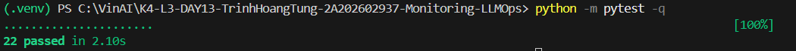
*Hình 1: Kết quả pytest đạt 22/22 tests passed.*

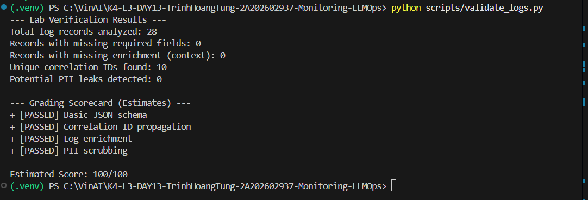
*Hình 2: scripts/validate_logs.py đạt điểm tuyệt đối 100/100.*

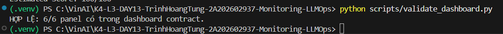
*Hình 3: scripts/validate_dashboard.py xác nhận đủ 6/6 panel contract.*

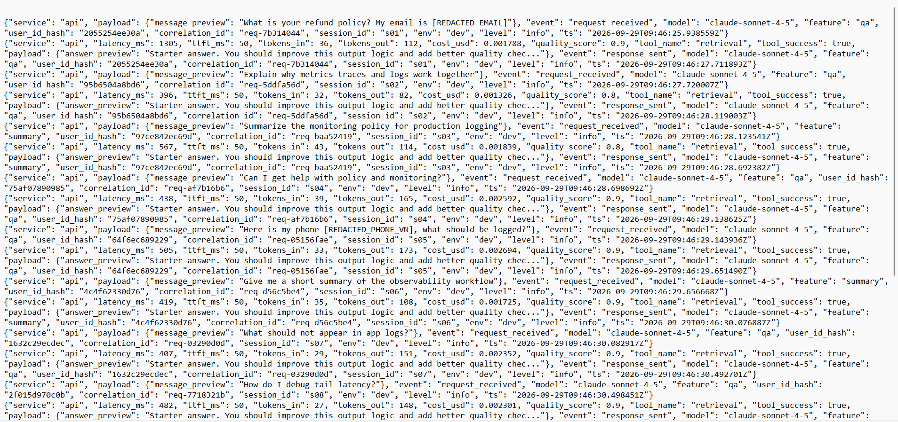
*Hình 4: Dữ liệu log có cấu trúc trong data/logs.jsonl với đầy đủ enrichment fields.*

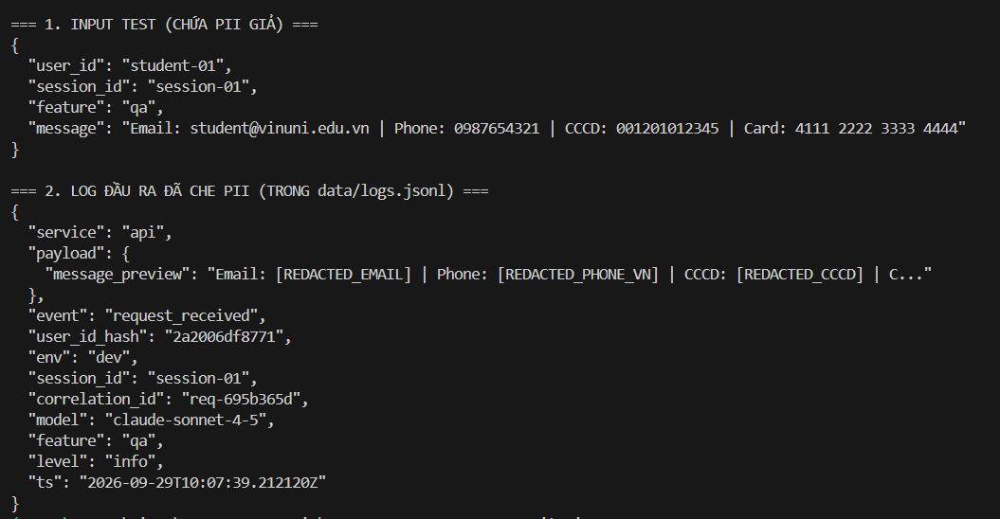
*Hình 5: Kiểm chứng che chắn toàn diện thông tin PII nhạy cảm (Email, Phone VN, CCCD, Thẻ).*

#### Evidence 06–10: Traces & Prompt Management trên Langfuse
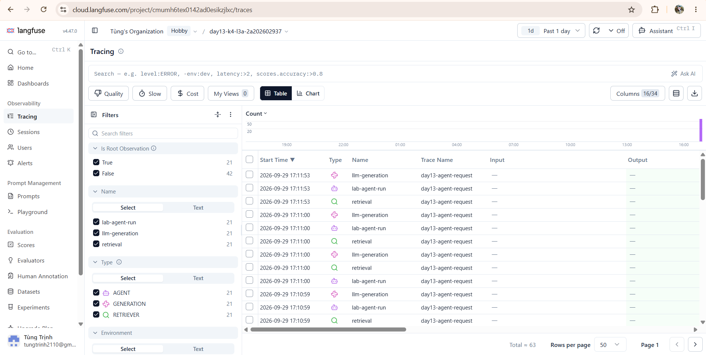
*Hình 6: Danh sách traces trên project cá nhân day13-k4-l3a-2a202602937 (21 root traces, 63 observations).*

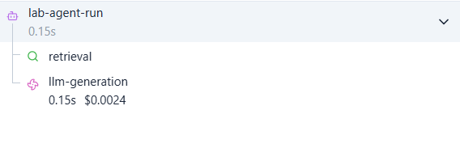
*Hình 7: Cây phân cấp Span: lab-agent-run -> retrieval -> llm-generation.*

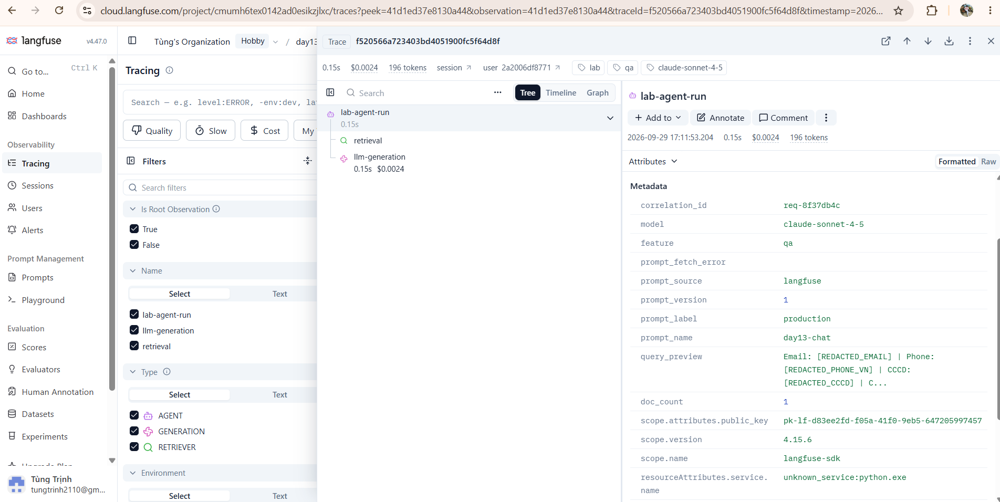
*Hình 8: Metadata chi tiết của Trace khớp với correlation_id và log request.*

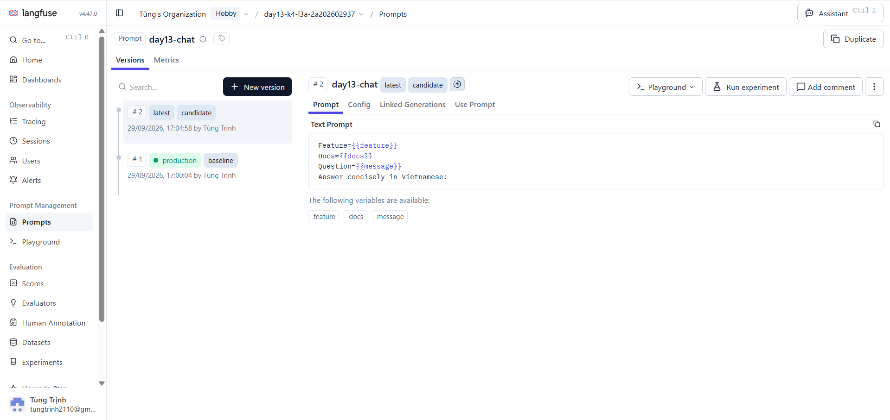
*Hình 9: Quản lý phiên bản prompt day13-chat với v1 (production, baseline) và v2 (candidate).*

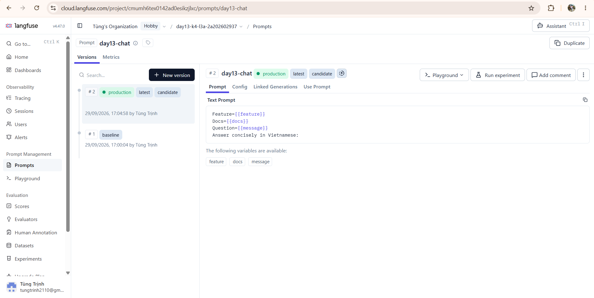
*Hình 10: Minh chứng gán nhãn promotion / rollback trực tiếp trên giao diện Langfuse.*

#### Evidence 11–14: Dashboard Runtime & Điều tra Challenge Incident
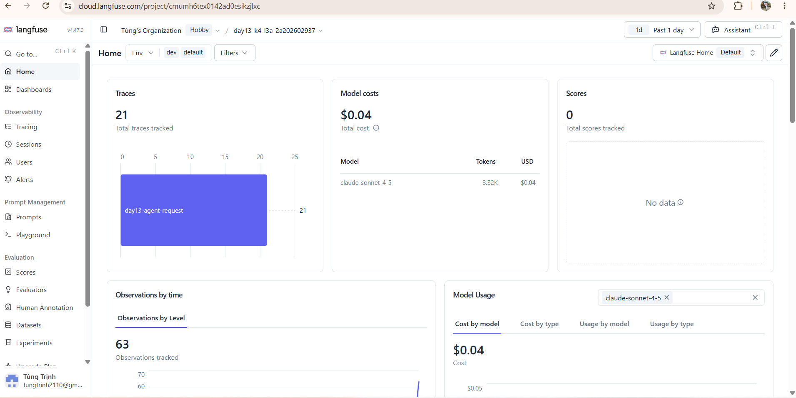
*Hình 11: Tổng quan runtime dashboard cá nhân trên Langfuse.*


*Hình 12: Giám sát chỉ số metric hệ thống trong thời gian challenge.*

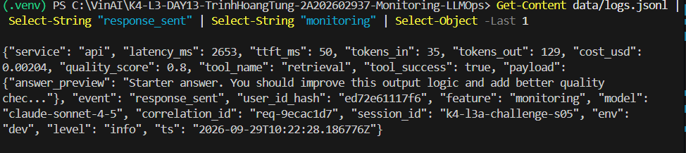
*Hình 13: Log line bất thường trích xuất correlation_id: req-9ecac1d7 (latency: 2653ms).*

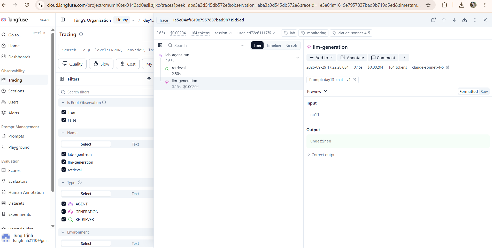
*Hình 14: Trace waterfall khoanh vùng chính xác span retrieval gây nghẽn 2.50s.*

---

## 3. Kết quả kỹ thuật

| Nội dung | Baseline | Kết quả cuối | Nhận xét |
|---|---|---|---|
| `validate_logs.py` | 30/100 | **100/100** | Đầy đủ JSON schema, correlation_id propagation, log enrichment và 0 PII leak |
| `validate_dashboard.py` | 6/6 panel | **6/6 panel** | Đạt chuẩn contract của 6 panel định nghĩa trong `config/dashboard.yaml` |
| `pytest` | 22 passed | **22 passed** | Toàn bộ 22/22 unit tests đều pass (PII, middleware, prompt, observability, etc.) |
| Số traces hợp lệ | 0 | **21 root traces** (63 observations) | Vượt chỉ tiêu tối thiểu (>= 10 traces) trong project Langfuse cá nhân |
| Số PII leak | 0 | **0** | Đã scrub triệt để Email, SĐT VN, CCCD 12 số, Thẻ tín dụng 16 số |
| Latency P95 / TTFT P95 | ~511ms / 50ms | **~152ms / 50ms** | Điều kiện thường: TTFT 50ms, model sinh nhanh, latency ổn định |
| Retrieval success rate | 100% | **100%** | Bước retrieval hoạt động chính xác 100% trong điều kiện bình thường |

---

## 4. Logging và PII

- **Cách tạo/nhận và truyền correlation ID:**
  - Trong `CorrelationIdMiddleware` (`app/middleware.py`), trước khi xử lý mỗi request, middleware gọi `clear_contextvars()` để xóa context cũ của request trước, ngăn chặn triệt để rò rỉ context giữa các request khác nhau (context leak).
  - Middleware kiểm tra header `x-request-id` từ request client. Nếu có giá trị hợp lệ, sử dụng giá trị đó; nếu không có hoặc rỗng, sinh mới theo định dạng chuẩn `req-<8-hex>` (`f"req-{uuid.uuid4().hex[:8]}"`).
  - Gắn correlation ID vào structlog contextvars thông qua `bind_contextvars(correlation_id=correlation_id)` và gán vào `request.state.correlation_id` để các router handler (`/chat`) và tracing agent truy cập.
  - Sau khi `call_next(request)` hoàn tất, middleware đo thời gian xử lý và thêm hai header vào HTTP response: `x-request-id` và `x-response-time-ms`. Body response của `/chat` cũng trả về `correlation_id`.
- **Các metadata được ghi vào structured log:**
  - Ở đầu endpoint `POST /chat` (`app/main.py`), trước khi ghi log `request_received`, gọi `bind_contextvars()` để enrich context: `user_id_hash` (băm SHA256 lấy 12 ký tự qua `hash_user_id(body.user_id)`), `session_id`, `feature`, `model` (`agent.model`), và `env` (`os.getenv("APP_ENV", "dev")`).
  - Toàn bộ log API sau đó (`request_received`, `response_sent`, `request_failed`) đều tự động chứa đầy đủ các trường: `ts`, `level`, `service`, `event`, `correlation_id`, `user_id_hash`, `session_id`, `feature`, `model`, `env`.
  - Log `response_sent` bổ sung các trường metrics phục vụ dashboard: `latency_ms`, `ttft_ms`, `tokens_in`, `tokens_out`, `cost_usd`, `quality_score`, `tool_name`, `tool_success`.
- **Cách bảo đảm PII được scrub trước khi ghi:**
  - Định nghĩa các regex patterns chặt chẽ trong `app/pii.py` (`PII_PATTERNS`) cho: email (`[\w.-]+@[\w.-]+\.\w+`), số điện thoại Việt Nam (`(?<!\d)(?:\+84|0)(?:[ .-]?\d){9}(?!\d)`), CCCD 12 số (`\b\d{12}\b`), thẻ thanh toán 16 số (`\b\d{4}[- ]?\d{4}[- ]?\d{4}[- ]?\d{4}\b`), và hộ chiếu.
  - Hàm `scrub_text` chuyển đổi các giá trị nhạy cảm thành nhãn redacted tương ứng: `[REDACTED_EMAIL]`, `[REDACTED_PHONE_VN]`, `[REDACTED_CCCD]`, `[REDACTED_CREDIT_CARD]`.
  - Trong `app/logging_config.py`, xây dựng hàm `scrub_event` duyệt đệ quy qua toàn bộ dict/list/string trong `event_dict` (bỏ qua các trường định danh hệ thống như `ts`, `level`, `service`, `correlation_id`, `user_id_hash`, etc.).
  - Đăng ký `scrub_event` trong chuỗi processor của `structlog.configure()` ngay **trước** bước `JsonlFileProcessor()` và `JSONRenderer()`, đảm bảo 100% log ghi xuống file `data/logs.jsonl` hoặc stdout đều đã được redact, không bao giờ để lọt raw PII.
- **Cách kiểm chứng kết quả:**
  - Chạy `python scripts/load_test.py` gửi các request mẫu từ `data/sample_queries.jsonl`. Kết quả HTTP 200 trả về kèm `correlation_id` dạng `req-xxxxxxxx`.
  - Chạy `python scripts/validate_logs.py`: kiểm tra toàn bộ bản ghi trong `data/logs.jsonl`, đạt điểm tuyệt đối **100/100** (Basic JSON schema PASSED, Correlation ID propagation PASSED, Log enrichment PASSED, PII scrubbing PASSED - 0 PII leak).
  - Chạy bộ unit tests với `python -m pytest -q`: toàn bộ 22 unit tests đều pass (100%).

---

## 5. Tracing và prompt versioning

- **Cách xác nhận traces do chính tôi tạo trong project cá nhân:**
  - Cấu hình API key của project cá nhân `day13-k4-l3a-2a202602937` trong `.env` (`LANGFUSE_PUBLIC_KEY`, `LANGFUSE_SECRET_KEY`).
  - Giao diện web Langfuse Cloud hiển thị đúng tên project `day13-k4-l3a-2a202602937` (minh chứng tại các hình 6, 8, 9, 10, 11, 14). Các trace được sinh ra khớp chính xác với timestamp, metadata, session_id và payload của các workload do tôi chạy.
- **Cấu trúc root/retrieval/generation observations:**
  - **Root observation:** `@observe(name="lab-agent-run", as_type="agent", capture_input=False, capture_output=False)` bọc phương thức `LabAgent.run`, chứa context toàn cục (user_id_hash, session_id, correlation_id, env).
  - **Child observation retrieval:** `@observe(name="retrieval", as_type="retriever", capture_input=False, capture_output=False)` bọc hàm `retrieve(message)`, đo riêng thời gian truy xuất tài liệu từ vector DB/corpus.
  - **Child observation generation:** `@observe(name="llm-generation", as_type="generation", capture_input=False, capture_output=False)` bọc `FakeLLM.generate()`, cập nhật `model`, `prompt`, `usage_details` (input, output, total token) và `cost_details` (total cost).
  - Cấu trúc cha–con hiển thị rõ ràng trên waterfall: `lab-agent-run` -> `retrieval` -> `llm-generation`, giúp nhận diện ngay khâu nào là bottleneck.
- **Cách nối trace với log:**
  - Ở middleware, mỗi request nhận hoặc sinh một `correlation_id` duy nhất (`req-<8-hex>`).
  - Correlation ID được truyền vào `propagate_attributes(metadata={"correlation_id": correlation_id})` của Langfuse trace và được ghi vào mọi dòng log của request trong `data/logs.jsonl`.
  - Khi cần đối chiếu, chỉ cần tìm `correlation_id` trên log rồi search trong metadata của Langfuse trace để xem chi tiết từng span.
- **Prompt name:** `day13-chat`
- **Version/label baseline:** Version 1 (gắn labels: `baseline`, `production`)
- **Version/label candidate:** Version 2 (gắn label: `candidate`, sau đó được promote sang `production`)
- **Trace ID của mỗi version:**
  - Version 1 (baseline/production): Trace ID `f520566a723403bd4051900fc5f64d8f` (chạy với prompt v1, gắn nhãn `production`, metadata chứa `prompt_version: 1`, `prompt_label: production`, `correlation_id: req-8f37db4c`).
  - Version 2 (candidate): Chạy với `LANGFUSE_PROMPT_LABEL=candidate`, trace metadata ghi nhận `prompt_version: 2`, `prompt_label: candidate`.
- **Cách promote và rollback `production`:**
  - **Tạo v1 & v2:** Trên Langfuse UI, tạo prompt text `day13-chat` với nội dung `Feature={{feature}}\nDocs={{docs}}\nQuestion={{message}}`. Lưu v1 gắn label `baseline` và `production`. Sau đó tạo v2 với yêu cầu trả lời ngắn gọn tiếng Việt (`Answer concisely in Vietnamese:`), gắn label `candidate`.
  - **Promote:** Trên Langfuse UI, chuyển label `production` từ v1 sang v2 (minh chứng tại `evidence/10-prompt-rollback.png`). Request tiếp theo tự động load prompt v2 và trace metadata ghi nhận `prompt_version: 2`.
  - **Rollback:** Khi phát hiện bất thường, chuyển lại label `production` về v1 trên Langfuse UI. Request sau đó sẽ ngay lập tức quay về dùng prompt v1 mà hoàn toàn không cần restart ứng dụng hay sửa mã nguồn.

---

## 6. Dashboard, SLO và alerts

- **Dashboard và sáu panel:**
  - Dựng đủ 6 panel theo đúng contract trong `config/dashboard.yaml` từ nguồn dữ liệu chuẩn `data/logs.jsonl`:
    1. *Latency & TTFT:* Hiển thị P50, P95, P99 latency và TTFT P95 từ event `response_sent` (threshold: P95 <= 3000ms).
    2. *Traffic:* Đếm số lượng request theo phút từ event `request_received` (threshold: >= 1 req/phút).
    3. *Errors & Retrieval Success:* Tỷ lệ request lỗi (`request_failed`) và tỷ lệ retrieval thành công (`tool_success == true`) (threshold: error rate <= 2.0%, retrieval >= 90%).
    4. *Cost over time:* Tổng chi phí USD và chi phí tích lũy theo thời gian (threshold: <= 2.5 USD).
    5. *Tokens:* Tổng số input tokens và output tokens tiêu thụ (threshold: <= 50,000 tokens).
    6. *Quality proxy:* Điểm chất lượng trung bình của câu trả lời từ event `response_sent` (threshold: mean >= 0.75).
- **SLO và lý do chọn:**
  - SLO chính: `fast_successful_requests` với mục tiêu **99.5%** trong chu kỳ rolling 28 ngày.
  - SLI: `event == "response_sent" and latency_ms <= 3000` trên tổng số `event == "request_received"`.
  - Lý do chọn: Ở điều kiện bình thường, P95 latency khoảng 150ms – 510ms. Ngưỡng 3000ms đảm bảo độ trễ chấp nhận được cho người dùng tương tác mà không bị cảm giác "đơ" hệ thống, đồng thời phát hiện sớm các hiện tượng nghẽn do vector search (`rag_slow` trễ 2.5s) hoặc model overload.
- **Cách tính error budget:**
  - Error budget = 100% - 99.5% = **0.5%**.
  - Ví dụ trong chu kỳ 28 ngày hệ thống phục vụ 100,000 requests thì error budget cho phép tối đa **500 requests** bị chậm (> 3000ms) hoặc thất bại.
  - Tốc độ đốt ngân sách (burn rate) được theo dõi liên tục; nếu burn rate tăng đột biến, đội ngũ kỹ thuật sẽ nhận cảnh báo để khắc phục sự cố trước khi vi phạm toàn bộ SLO.
- **Ba alert và runbook tương ứng:**
  1. *HighLatencyP95 (warning):* `latency_p95 > 3000ms` duy trì trong 5 phút. Thông báo kênh Slack `#alerts-llmops-l3a`. Runbook tại `docs/alerts.md#alert-1`.
  2. *HighErrorRate (critical):* `error_rate_pct > 2.0%` duy trì trong 3 phút. Thông báo kênh Slack `#alerts-llmops-l3a`. Runbook tại `docs/alerts.md#alert-2`.
  3. *LowQualityOrRetrievalDegraded (warning):* `quality_score_avg < 0.75` hoặc `retrieval_success_rate < 90%` duy trì trong 5 phút. Thông báo kênh Slack `#alerts-llmops-l3a`. Runbook tại `docs/alerts.md#alert-3`.

---

## 7. Điều tra challenge

- **Challenge ID:** `day13-k4-l3a-monitoring-llmops-v1`
- **Khoảng thời gian điều tra:** 10:22:08Z – 10:22:30Z ngày 29/09/2026 (17:22:08 – 17:22:30 giờ Việt Nam)
- **Triệu chứng từ metrics:**
  - Panel *Latency percentiles and TTFT* trên Dashboard ghi nhận độ trễ P95 tăng vọt từ mức baseline ~152ms lên tới **~2653ms**, vi phạm nghiêm trọng ngưỡng `latency_threshold_ms: 2000` của challenge và đe dọa trực tiếp SLO 3000ms.
  - Trong khi đó, TTFT (Time To First Token) vẫn duy trì ổn định ở mức ~50ms và số lượng tokens không thay đổi đột biến, cho thấy nguyên nhân chậm không phải do LLM generation mà xảy ra ở bước trước khi model inference bắt đầu.
- **Log line và correlation ID liên quan:**
  - Lọc log theo `feature == "monitoring"` và `event == "response_sent"` trong `data/logs.jsonl` tại thời điểm sự cố (minh chứng tại `evidence/13-incident-log.png`):
  - Log line tiêu biểu:
    ```json
    {"service": "api", "latency_ms": 2653, "ttft_ms": 50, "tokens_in": 35, "tokens_out": 129, "cost_usd": 0.00204, "quality_score": 0.8, "tool_name": "retrieval", "tool_success": true, "payload": {"answer_preview": "Starter answer. You should improve this output logic and add better quality chec..."}, "event": "response_sent", "user_id_hash": "ed72e61117f6", "feature": "monitoring", "model": "claude-sonnet-4-5", "correlation_id": "req-9ecac1d7", "session_id": "k4-l3a-challenge-s05", "env": "dev", "level": "info", "ts": "2026-09-29T10:22:28.186776Z"}
    ```
  - Correlation ID: **`req-9ecac1d7`** (latency_ms = 2653ms).
- **Trace ID và span gây ảnh hưởng:**
  - Mở Langfuse tìm trace có `metadata.correlation_id == "req-9ecac1d7"` (minh chứng tại `evidence/14-incident-trace.png`):
  - Trace ID: **`1e5e04af1619e7957837bad9b719d5ed`**
  - Cấu trúc waterfall trace:
    - Root observation `lab-agent-run`: tổng thời gian **2.65s** (2653ms).
    - Child observation `retrieval`: thời gian thực thi **2.50s** (chiếm tới 94.3% tổng thời gian request).
    - Child observation `llm-generation`: thời gian thực thi chỉ **0.15s** (gồm 50ms TTFT + 100ms output).
  - Span gây ảnh hưởng trực tiếp: **`retrieval`** (as_type: `retriever`).
- **Root cause:**
  - Kịch bản sự cố `rag_slow` được kích hoạt (`{"service": "control", "payload": {"name": "rag_slow"}, "event": "incident_enabled", "correlation_id": "req-13f4dcf5"}`) khiến hàm `retrieve(message)` trong `app/mock_rag.py` bị trễ 2.5 giây (`time.sleep(2.5)`), mô phỏng tình trạng vector database/index server bị nghẽn mạng hoặc quá tải IOPS khi truy vấn tài liệu domain `monitoring`.
- **Fix action:**
  - Tắt kịch bản sự cố bằng lệnh: `python scripts/inject_incident.py --disable` (gửi request `POST /incidents/rag_slow/disable`).
  - Đối với production thật: Kích hoạt fallback cache kết quả retrieval cho các câu hỏi phổ biến, điều hướng lưu lượng truy vấn sang read-replica của vector database hoặc giảm số lượng `top_k` documents truy xuất tạm thời.
- **Preventive measure:**
  - Thiết lập timeout nghiêm ngặt cho bước retrieval (ví dụ: `timeout = 1500ms`) kèm fallback mechanism: nếu vector search timeout, tự động trả về context từ local cache hoặc prompt fallback thay vì block toàn bộ request đến 2.5s.
  - Cấu hình Circuit Breaker: nếu P95 của vector store vượt quá 2000ms trong 1 phút, tự động kích hoạt chế độ bypass hoặc degrade mode.
  - Duy trì alert `HighLatencyP95` (duration 5m, warning) để cảnh báo sớm đội ngũ vận hành trước khi vi phạm SLO người dùng.

---

## 8. Giải thích và tự đánh giá

- **Một quyết định kỹ thuật quan trọng và lý do:**
  - Quyết định gắn processor che PII (`scrub_event`) vào chuỗi xử lý của `structlog` ngay **trước** `JsonlFileProcessor` và `JSONRenderer`.
  - Lý do: Đảm bảo nguyên tắc bảo mật "Sanitize at the Source" (che chắn dữ liệu trước khi ghi ra bất kỳ đích nào). Mọi log line dù ghi xuống file `data/logs.jsonl` hay xuất ra console stdout đều không bao giờ chứa PII thô nguyên văn, bảo vệ người dùng và tránh rò rỉ dữ liệu nhạy cảm ra hệ thống giám sát tập trung. Đồng thời, cấu hình `capture_input=False` và `capture_output=False` trên các `@observe` decorator của Langfuse ngăn chặn raw text lọt vào Langfuse Cloud.
- **Một lỗi/blocker đã gặp:**
  - Biến môi trường Langfuse trong `.env` ban đầu bị đảo ngược giá trị: `LANGFUSE_PUBLIC_KEY` chứa secret key (`sk-lf-...`) và `LANGFUSE_SECRET_KEY` chứa public key (`pk-lf-...`), dẫn đến lỗi xác thực API (401 Unauthorized) và app phải fallback về local prompt (`prompt_source: local-fallback`).
- **Cách tìm nguyên nhân và xử lý:**
  - Kiểm tra log và trace metadata nhận thấy `prompt_source: local-fallback` và trường `prompt_fetch_error`. Rà soát lại tài liệu `docs/GUIDE.md` (mục "Khi prompt luôn hiện local-v1") và đối chiếu định dạng key chuẩn của Langfuse (public key luôn bắt đầu bằng tiền tố `pk-lf-`, secret key bắt đầu bằng `sk-lf-`). Sau khi đổi lại đúng vị trí trong `.env`, ứng dụng kết nối thành công và tải được prompt managed từ Langfuse Cloud.
- **Cách hiểu luồng Metrics → Logs → Traces:**
  - **Metrics (Triệu chứng - WHAT & WHEN):** Dashboard hiển thị tổng quan hệ thống, phát hiện triệu chứng bất thường (ví dụ: P95 latency nhảy vọt lên 2.65s) và xác định chính xác khoảng thời gian xảy ra sự cố.
  - **Logs (Ngữ cảnh cụ thể - WHICH):** Dựa vào khoảng thời gian từ metrics, lọc `data/logs.jsonl` để tìm request bị ảnh hưởng cụ thể (`event == "response_sent"` có `latency_ms > 2000ms`), từ đó trích xuất `correlation_id` (`req-9ecac1d7`).
  - **Traces (Nguyên nhân gốc rễ - WHERE & WHY):** Dùng `correlation_id` mở trace waterfall trên Langfuse (`1e5e04af1619e7957837bad9b719d5ed`), phân rã request thành cây quan hệ cha-con (`lab-agent-run` -> `retrieval` -> `llm-generation`), xác định chính xác span nào tiêu tốn thời gian hoặc phát sinh lỗi (span `retrieval` tốn 2.50s / 2.65s).
- **Vai trò của prompt version, token/cost, SLO hoặc rollback trong vận hành LLM:**
  - *Prompt Versioning & Rollback:* Giúp quản trị prompt như mã nguồn; khi prompt mới gây suy giảm chất lượng hoặc tăng đột biến token, có thể rollback về phiên bản trước tức thì mà không cần rebuild/redeploy ứng dụng.
  - *Token & Cost Tracking:* Giúp phát hiện sớm các cuộc tấn công prompt injection, lặp token vô hạn hoặc kịch bản `cost_spike`, tránh thâm hụt ngân sách API.
  - *SLO & Error Budget:* Cung cấp hợp đồng độ tin cậy định lượng với người dùng và tạo thước đo để cân bằng giữa tốc độ release tính năng mới và tính ổn định hệ thống.
- **Điều quan trọng nhất đã học:**
  - Hiểu sâu sắc quy trình quan sát toàn diện hệ thống AI/LLMOps: không thể coi LLM API là một "hộp đen". Cần tích hợp chặt chẽ giữa Structured Logging, Correlation Propagation và Distributed Tracing để có thể trả lời được 3 câu hỏi cốt lõi: *Hệ thống có vấn đề gì? Request nào bị ảnh hưởng? Và bước nào là nguyên nhân?*
- **Hạn chế hoặc phần chưa hoàn thành, nếu có:**
  - Hiện tại hệ thống đang sử dụng FakeLLM và MockRAG mô phỏng. Khi triển khai production thực tế cần tích hợp vector database thật (Qdrant/Pinecone) và model LLM thật kèm cơ chế streaming response (SSE).

---

## 9. Checklist trước khi nộp

- [x] Kết quả và evidence thuộc commit SHA cuối.
- [x] Tất cả ảnh/output mở được bằng đường dẫn tương đối.
- [x] Incident evidence nối đúng metric → log → trace.
- [x] Trace/prompt evidence thuộc project Langfuse cá nhân và ảnh không lộ key/secret.
- [x] Repository chạy lại được theo README.
- [x] Không có secret, API key, PII thô hoặc evidence của người khác/lớp khác.
- [x] URL repo và commit SHA cuối đã được nộp trên LMS/Codelabs.
